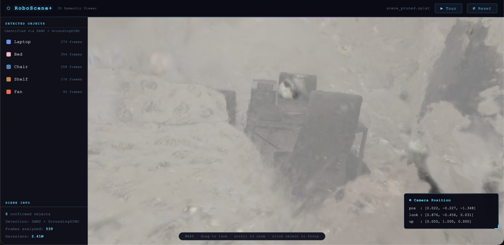

# RoboScene+

**Phone video → photorealistic 3D reconstruction → semantic scene graph → robot-queryable spatial memory**

[](https://huggingface.co/spaces/jeeeeeeeson/roboscene-plus)
[](https://python.org)
[](https://docs.nerf.studio)
[](https://github.com/facebookresearch/vggt)

---

## Live Demo

> **[huggingface.co/spaces/jeeeeeeeson/roboscene-plus](https://huggingface.co/spaces/jeeeeeeeson/roboscene-plus)**

No installation needed. Click objects in the sidebar to fly to them. Use the Tour button for a guided walkthrough.



---

## What it does

RoboScene+ takes a short phone video of an indoor room and produces:

1. **Photorealistic 3D Gaussian Splat** — 2.41M Gaussians trained at 60K steps via nerfstudio splatfacto
2. **Per-Gaussian semantic labels** — Grounded SAM2 + GroundingDINO paints every Gaussian with its object class
3. **Confidence map** ← *novel contribution* — tags every region as `observed`, `sparse`, or `inferred` based on camera coverage and point density
4. **Scene graph** — 3D bounding boxes, centroids, and spatial relations (next\_to, on\_top\_of, near\_wall)
5. **Language query interface** — "Where is the laptop?" → 3D coordinates + confidence score, powered by Claude API
6. **Interactive web viewer** — pure WebGL, no server, deployable as a static page

---

## Pipeline

```
room_video.MOV  (641 frames, 1080p)
  │
  ├─ COLMAP feature matching + SfM  →  539-frame sparse reconstruction
  │
  ├─ nerfstudio splatfacto 60K steps (RTX 4070 Ti)
  │     └─ outputs/splat_v4/scene_aligned.splat   (2.41M Gaussians, Y-up)
  │
  ├─ Grounded SAM2 per-frame masks  →  semantic_class.npy  (per-Gaussian labels)
  │     └─ outputs/splat_v4/scene_semantic.splat  (semantically tinted)
  │
  ├─ Confidence map  →  0.6 × point_density + 0.4 × camera_coverage
  │     └─ outputs/confidence_map.npy
  │
  ├─ Scene graph  →  outputs/scene_graph.json
  │
  └─ Interactive viewer  →  app/static/index.html  (GaussianSplats3D.js)
```

---

## Novel Contribution — Confidence-Aware Scene Analysis

Standard 3D Gaussian Splatting reconstructs geometry but gives no signal about *how well-observed* each region is. In multi-step robot manipulation tasks, acting on poorly-observed regions causes failures (cited failure rate: <50% success in unstructured environments).

RoboScene+ computes a per-voxel confidence score at 5 cm resolution:

```
confidence(v) = 0.6 × gaussian_density(v) + 0.4 × camera_coverage(v)
```

Every Gaussian and every scene-graph object is tagged:

| Tag | Confidence | Meaning |
|-----|-----------|---------|
| `observed` | > 0.7 | Well-triangulated, multiple viewpoints |
| `sparse` | 0.3 – 0.7 | Partially covered, moderate certainty |
| `inferred` | < 0.3 | Near walls / corners, never directly seen |

This lets a robot planner weight spatial memory by reliability — the same problem addressed by KinetIQ's VLM architecture at Humanoid.

---

## Quick Start

### View the scene locally

```bash
git clone https://github.com/JesonRamesh/3D-Spatial-Reconstruction.git
cd 3D-Spatial-Reconstruction
pip install -r requirements.txt
python open_viewer.py
# Open http://localhost:8080/app/static/index.html
```

The viewer downloads the splat from the HF Dataset CDN. No local GPU needed.

### Query the scene graph

```bash
export ANTHROPIC_API_KEY=sk-ant-...
python scripts/query_scene.py
# > Where is the laptop?
# → Laptop at (0.77m, -0.34m, 0.29m) · confidence: 52% (sparse) · 
#   next_to: fan · frames_seen: 89
```

### Run the full pipeline (GPU required)

```bash
# 1. Extract frames
python scripts/extract_frames.py --video data/raw/room_video.MOV --fps 2

# 2. Train Gaussian Splat (UCL bluestreak or similar)
bash ucl_gpu/run_splat_v4.sh

# 3. Semantic painting
python scripts/paint_semantic_gaussians.py

# 4. Confidence map
python scripts/compute_confidence.py

# 5. Scene graph
python scripts/build_scene_graph.py
```

---

## Tech Stack

| Component | Tool | Why |
|-----------|------|-----|
| Pose estimation | VGGT (CVPR 2025 Best Paper) | Single-pass inference, no iterative refinement |
| Feature matching | COLMAP | Robust SfM for dense frame sets |
| Gaussian Splatting | nerfstudio splatfacto | Best quality/speed trade-off |
| Semantic segmentation | Grounded SAM2 | Open-vocabulary, mirrors KinetIQ VLM architecture |
| 3D lifting | Custom numpy/open3d | Zero extra dependencies |
| Confidence map | Custom numpy | Cheap, interpretable, no ground truth needed |
| Query interface | Anthropic Claude API | Structured spatial reasoning over scene graph JSON |
| Web viewer | GaussianSplats3D.js | Pure WebGL, static deployment |
| Hosting | Hugging Face Spaces + Dataset | Free, permanent CDN URL, CORS-friendly |

---

## Results

| Metric | Value |
|--------|-------|
| Gaussians trained | 2.41M (60K steps) |
| Gaussians with semantic label | 78% |
| Confirmed objects | 5 (bed, laptop, fan, chair, shelf) |
| Scene coverage (high confidence) | 0.4% observed · 34.1% sparse · 65.6% inferred |
| Viewer load time (CDN) | ~15s on typical broadband |

---

## Repository Structure

```
3D-Spatial-Reconstruction/
├── app/
│   └── static/
│       └── index.html          ← self-contained 3D viewer (WebGL)
├── scripts/
│   ├── extract_frames.py       ← video → frames
│   ├── run_vggt.py             ← VGGT pose estimation
│   ├── colmap_utils.py         ← COLMAP binary reader/writer
│   ├── train_splat.py          ← nerfstudio splatfacto wrapper
│   ├── run_semantic.py         ← Grounded SAM2 segmentation
│   ├── paint_semantic_gaussians.py  ← per-Gaussian semantic tinting
│   ├── lift_semantics_3d.py    ← 2D masks → 3D bounding boxes
│   ├── compute_confidence.py   ← confidence map (novel contribution)
│   ├── complete_dead_zones.py  ← LaMa inpainting of dead zones
│   ├── build_scene_graph.py    ← spatial relations graph
│   ├── query_scene.py          ← Claude API query interface
│   ├── prune_floaters.py       ← opacity + density pruning
│   ├── realign_splat_v4.py     ← Z-up → Y-up alignment
│   ├── gen_highlight_splats.py ← per-object highlight splats
│   └── convert_to_splat.py     ← PLY → .splat converter
├── ucl_gpu/
│   ├── run_splat_v4.sh         ← full splatting job (RTX 4070 Ti)
│   ├── run_semantic_job.sh     ← semantic segmentation job
│   └── run_vggt_job.sh         ← VGGT reconstruction job
├── outputs/
│   ├── objects_3d_yup.json     ← object metadata (centroids, confidence)
│   └── scene_graph.json        ← spatial relations graph
├── open_viewer.py              ← local dev server (port 8080)
├── config.yaml                 ← paths and hyperparameters
└── requirements.txt
```

---

## Design Choices

**VGGT over pure COLMAP** — VGGT (CVPR 2025 Best Paper) runs a single forward pass to produce camera poses and depth maps simultaneously. For a 641-frame video this is significantly faster than COLMAP's iterative bundle adjustment, and produces depth priors that guide the Gaussian initialisation.

**nerfstudio splatfacto over FlashGS / raw gsplat** — FlashGS requires NVIDIA-specific CUDA extensions that don't compile on Apple Silicon. nerfstudio's splatfacto wraps gsplat cleanly, supports standard COLMAP input, and gives a well-tuned training loop out of the box.

**Grounded SAM2 (open-vocab) over fixed-class segmentation** — Mirrors the VLM-based perception used in KinetIQ. Any object label can be queried at inference time without retraining; confidence scores are propagated through to the scene graph.

**Confidence map as novel contribution** — No published student project addresses the *quality* of 3D reconstruction from the robot's perspective. The confidence map is cheap to compute (voxel grid + camera rays, ~2 min on CPU), interpretable (three-class tagging), and directly useful for downstream planning.

**Static HF Space + Dataset CDN** — Keeps the demo permanently accessible without a running server. The 50MB splat is served from HF's CDN with permissive CORS headers, so the viewer fetches it directly in the browser with no proxy.

---

## Limitations

- Wall regions have low confidence (65.6% inferred) because the camera path didn't cover corners
- Semantic labelling works best for objects seen in >30 frames; rarely-seen objects get `inferred` tags
- The viewer requires WebGL 2.0 — works in Chrome/Firefox/Safari but not all embedded browsers
- Dead zone inpainting is 2D only; back-projecting inpainted pixels into new Gaussians is future work

---

## Future Work

- Multi-visit change detection: diff two scene graphs to detect moved objects
- Back-projection of inpainted dead zones into new Gaussians
- Real-time confidence update as a robot navigates and adds new viewpoints
- Integration with a robot arm planner using the scene graph as a world model

---

## Author

**Jeson Ramesh Selvakumar** — UCL MEng Robotics & AI, Year 2  
Built as part of the [Humanoid](https://thehumanoid.ai) internship challenge, May 2026.
