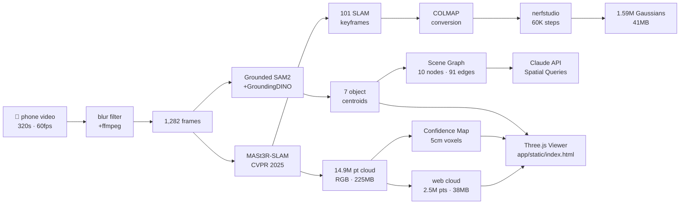
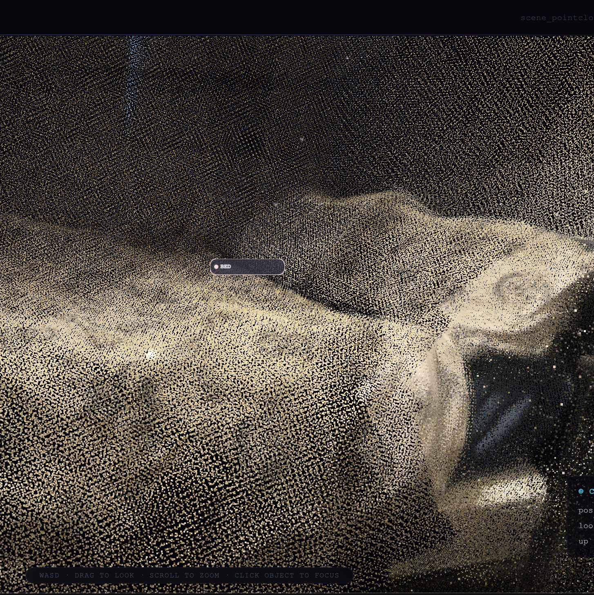
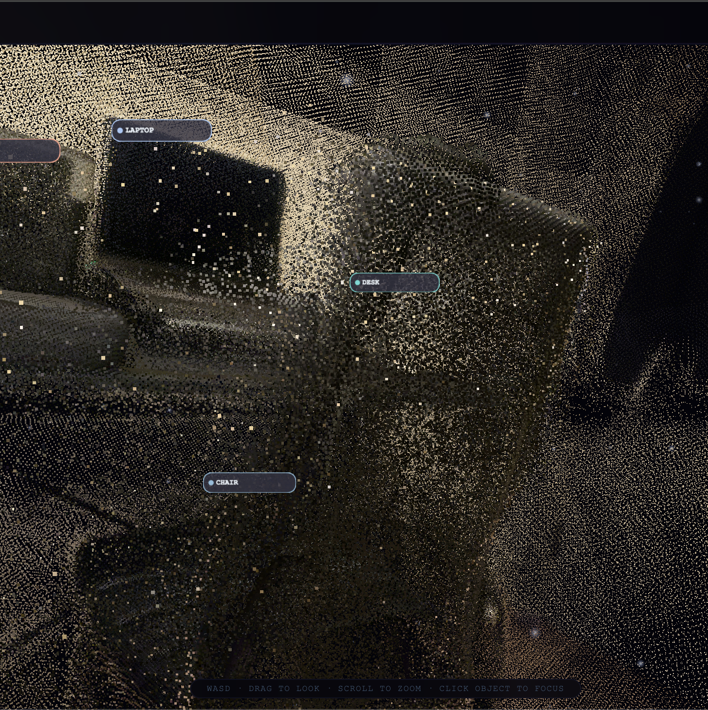
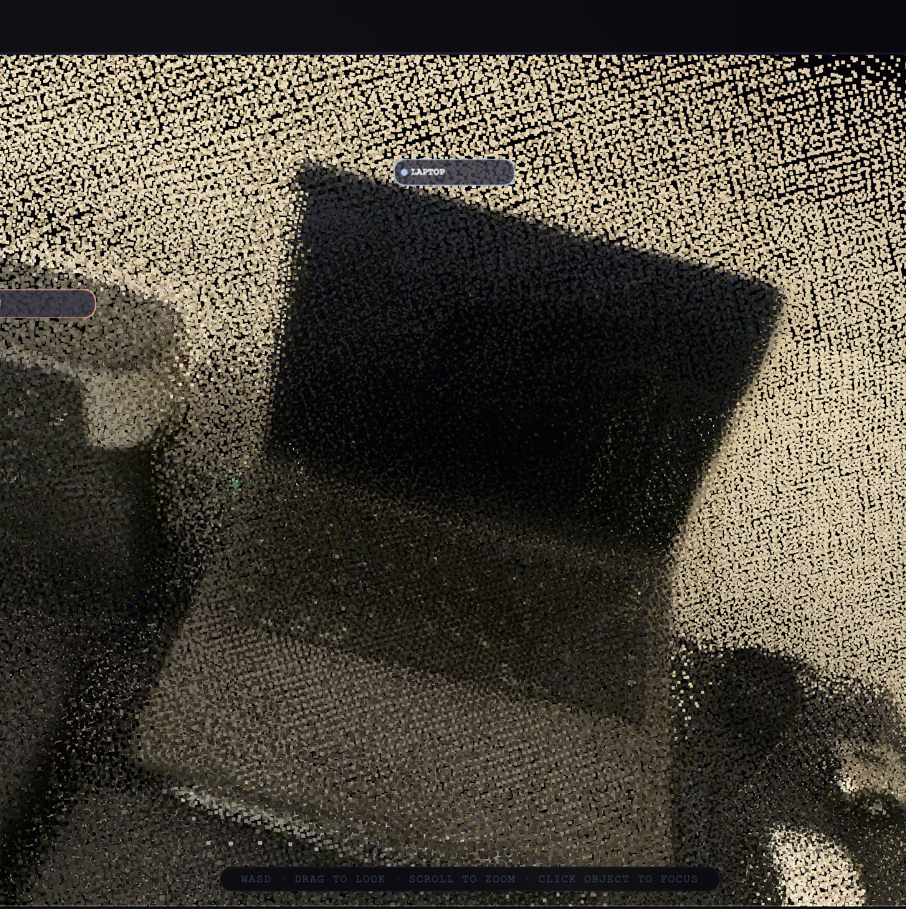
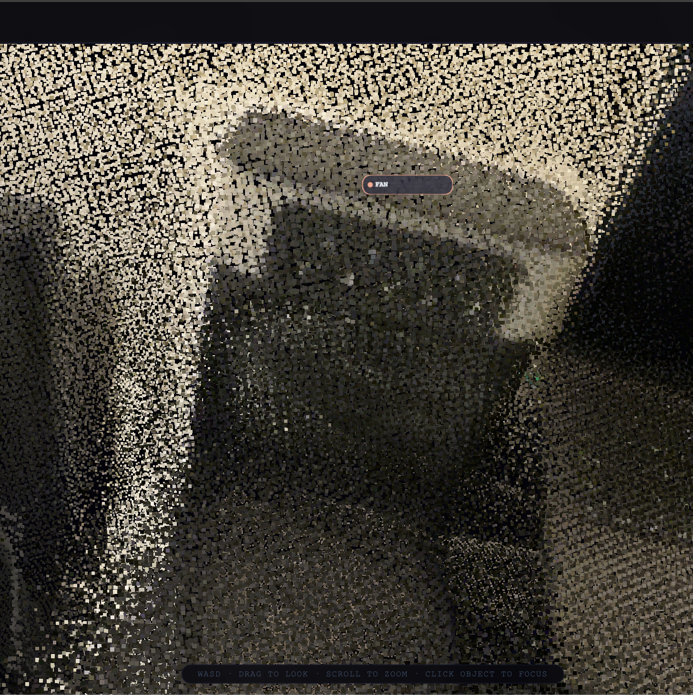
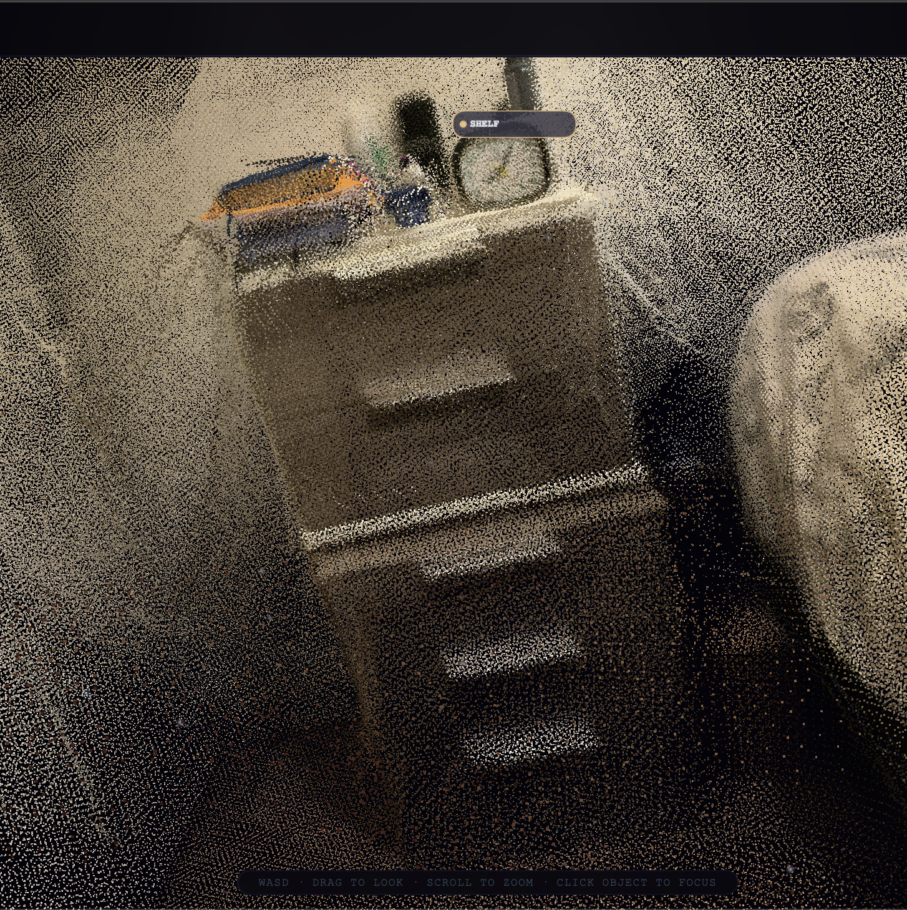

<h1 align="center">3D Spatial Reconstruction</h1>

<p align="center">
  <strong>Phone video → dense 3D reconstruction → semantic scene graph → robot-queryable spatial memory</strong>
</p>

<p align="center">
  <a href="https://python.org"></a>
  <a href="https://github.com/facebookresearch/MASt3R"></a>
  <a href="https://docs.nerf.studio"></a>
  <a href="https://github.com/IDEA-Research/Grounded-SAM-2"></a>
  <a href="https://anthropic.com"></a>
  <a href="https://github.com/JesonRamesh/3D-Spatial-Reconstruction/blob/main/LICENSE"></a>
</p>

<p align="center">
  
  <br/><em>Interactive viewer — dense 2.5M-point RGB cloud, floating 3D semantic labels, cinematic auto-tour</em>
</p>

## Overview

Takes a 5-minute handheld phone video of an indoor room and produces a navigable 3D scene queryable in natural language — **no GPU required to run it**.

The core contribution: standard 3D Gaussian Splatting gives no signal about *how reliably* each region was observed. This project adds a per-voxel confidence layer that tags every region as `observed`, `sparse`, or `inferred`, letting a robot planner weight spatial memory by reconstruction quality.

| Input | Output |
|---|---|
| 320 s video, 1920×1080, 60 fps | 14.9M-point dense RGB point cloud |
| 1,282 blur-filtered keyframes | 1.59M Gaussian splat (60K steps) |
| 101 SLAM keyframe poses | 10 labelled objects, 94% of Gaussians labeled |
| — | Language-queryable scene graph · 91 spatial edges |

&nbsp;

## Pipeline

```
room_video_v2.MOV  (320 s · 60 fps · 1080p)
         │
         ▼  ffmpeg + Laplacian blur filter
  data/frames_v3/                     1,282 sharp frames  (from ~19,200 raw)
         │
         ▼  MASt3R-SLAM  (CVPR 2025)
  outputs/mast3r_out_v2/
    ├─ dense_pointcloud.ply            14.9M pts · 225 MB · RGB
    └─ trajectory.txt                  101 SLAM keyframe poses (TUM)
         │
         ├──▶  spatial crop + alignment  →  scene_pointcloud_web.ply  (2.5M pts · 38 MB)
         │
         ├──▶  COLMAP conversion  →  nerfstudio splatfacto 60K steps
         │       └─ scene_pruned.splat   1.59M Gaussians · 41 MB
         │
         ├──▶  Grounded SAM2 + GroundingDINO  →  semantic_centroids.json
         │
         ├──▶  Confidence map  (0.6 × point_density + 0.4 × camera_coverage)
         │       └─ confidence_map.npy   154×160×152 voxels · 5 cm resolution
         │
         └──▶  Scene graph + Claude API  →  scene_graph.json
```

### Architecture



&nbsp;

## Novel Contribution — Confidence-Aware Reconstruction

A per-voxel confidence score decouples *appearance quality* (Gaussian opacity) from *observability* (how well the region was actually covered by the camera):

```
confidence(v) = 0.6 × gaussian_density(v) + 0.4 × camera_coverage(v)
```

| Tag | Threshold | Meaning |
|---|---|---|
| `observed` | > 0.70 | Well-triangulated — reliable for robot manipulation |
| `sparse` | 0.30 – 0.70 | Partially covered — plan cautiously |
| `inferred` | < 0.30 | Near walls / occluded — do not act without re-scan |

| Object | Confidence | Provenance | Frames seen |
|---|---|---|---|
| monitor | 52.6% | sparse | 10 |
| fan | 48.6% | sparse | 14 |
| lamp | 47.1% | sparse | 11 |
| laptop | 46.8% | sparse | 26 |
| chair | 44.4% | sparse | 28 |
| desk | 42.5% | sparse | 44 |
| bed | 41.0% | sparse | 35 |
| shelf | 28.5% | inferred | 13 |
| window | 29.7% | inferred | 21 |
| door | 25.3% | inferred | 21 |

<p align="center">
  
  <br/><em>Top-down RGB projection · coloured dots = object centroids · 3.68 × 3.70 m room footprint</em>
</p>

&nbsp;

## Semantic Detections

Open-vocabulary detection via Grounded SAM2 across 1,282 frames — 94% of 2.41M Gaussians labeled.

<table>
  <tr>
    <td align="center"><br/><sub>Bed · 813K Gaussians · 41.0%</sub></td>
    <td align="center"><br/><sub>Chair · 282K Gaussians · 44.4%</sub></td>
    <td align="center"><br/><sub>Laptop · 166K Gaussians · 46.8%</sub></td>
    <td align="center"><br/><sub>Fan · 41K Gaussians · 48.6%</sub></td>
    <td align="center"><br/><sub>Shelf · 139K Gaussians · 28.5%</sub></td>
  </tr>
</table>

&nbsp;

## Quick Start

No GPU required.

```bash
git clone https://github.com/JesonRamesh/3D-Spatial-Reconstruction.git
cd 3D-Spatial-Reconstruction
pip install -r requirements.txt
python open_viewer.py
```

Open **http://localhost:8080/app/static/index.html** in Chrome or Firefox.

> Loads `outputs/scene_pointcloud_web.ply` (38 MB) from localhost. WebGL 2.0 required.

### Controls

| Action | Input |
|---|---|
| Orbit | Click + drag |
| Fly forward / back | `W` / `S` |
| Strafe | `A` / `D` |
| Fly up / down | `Q` / `E` |
| Zoom | Scroll wheel |
| Fast movement | Hold `Shift` |
| Guided tour | `▶ Tour` or `T` |
| Reset view | `⌀ Reset` |
| Toggle sidebar | `›` left edge |

&nbsp;

## Language Queries

```bash
export ANTHROPIC_API_KEY=sk-ant-...
python scripts/query_scene.py
```

```
> Where is the laptop?
→ Laptop at (0.73m, 0.30m, 0.79m) · confidence 46.8% (sparse) · visible in 26 frames
  Relations: on_top_of desk · next_to fan · next_to chair

> Which objects are safe to interact with?
→ Most reliable: monitor (52.6%), fan (48.6%), laptop (46.8%)
  Avoid: shelf, window, door — inferred (<30%), insufficient camera coverage
```

&nbsp;

## Running the Full Pipeline

GPU required for MASt3R-SLAM and Gaussian Splatting. Developed on UCL bluestreak (RTX 4070 Ti SUPER, 16 GB VRAM).

```bash
# Extract frames
python scripts/extract_frames.py --video data/raw/room_video_v2.MOV --output data/frames_v3/ --fps 4

# MASt3R-SLAM  (~25 min, GPU)
python scripts/run_mast3r_slam.py --frames data/frames_v3/ --output outputs/mast3r_out_v2/

# COLMAP conversion
python scripts/colmap_utils.py --trajectory outputs/mast3r_out_v2/trajectory.txt --output data/mast3r_out_v2/sparse/0/

# Gaussian Splat  (~2 h, GPU)
bash ucl_gpu/run_splat_job.sh

# Semantic segmentation  (~45 min, GPU)
python scripts/run_semantic.py --frames_dir data/frames_v3/ --output_dir outputs/semantic/ --device cuda

# Semantic painting + confidence map
python scripts/paint_semantic_pointcloud.py
python scripts/compute_confidence.py

# Scene graph
python scripts/build_scene_graph.py
```

&nbsp;

## Results

| Metric | Value |
|---|---|
| Sharp frames extracted | 1,282 of ~19,200 raw |
| Dense point cloud | 14.9M pts · 225 MB |
| Web-ready point cloud | 2.5M pts · 38 MB |
| Gaussians trained | 1.59M · 60K steps |
| Gaussians labeled | 2,264,677 / 2,410,031 (94%) |
| Object classes | 10 detected · 5 in guided tour |
| Scene graph | 10 nodes · 91 edges |
| Room dimensions | 3.68 m × 2.00 m × 3.70 m |
| Total pipeline runtime | ~3.5 h (GPU stages on RTX 4070 Ti) |

&nbsp;

## Tech Stack

| Component | Tool |
|---|---|
| Dense reconstruction | MASt3R-SLAM (CVPR 2025) |
| Gaussian Splatting | nerfstudio splatfacto |
| Semantic segmentation | Grounded SAM2 + GroundingDINO |
| Confidence map | Custom numpy voxel grid |
| Scene graph | Custom Python |
| Language queries | Anthropic Claude API (claude-sonnet) |
| 3D viewer | Three.js + PLYLoader + OrbitControls |

&nbsp;

## Design Choices

**MASt3R-SLAM over COLMAP** — single feed-forward pass over all 1,282 frames produces a globally consistent cloud; COLMAP drops tracks on fast panning sections.

**Custom COLMAP writer** — `pycolmap` 4.0 broke the `Image()` API on Python 3.11+; a 200-line custom binary writer has zero extra dependencies.

**Per-voxel confidence over Gaussian opacity** — opacity encodes appearance, not observability. Camera ray density is an independent signal that opacity cannot provide.

**Open-vocabulary Grounded SAM2** — any object label can be queried without retraining; confidence scores propagate through to the scene graph.

**Single-file viewer** — `index.html` loads Three.js from CDN, zero build step, trivially deployable as a static page.

&nbsp;

## Limitations

- **34% navigability coverage** — the camera path covered the room centre well but missed corners, ceiling, and the back of the door. A slower, more systematic scan (panning each wall surface fully) would push coverage above 60%.
- **101 Gaussian training views** — MASt3R-SLAM selected 101 of 1,282 frames as keyframes; the splat is trained only on these. Wall surfaces appear flat and slightly blurry compared to what 1,282 training views would produce.
- **Semantic accuracy at low frame counts** — objects seen in fewer than ~15 frames receive weaker labels. The fan (14 frames) and lamp (11 frames) are at this threshold; the monitor was manually corrected after GroundingDINO mislabelled the laptop screen as a separate display.
- **Volume overestimates** — 3D bounding boxes include some background Gaussians captured by mask projection overlap. Tighter outlier rejection (`n_std=1.2`) would give more accurate object extents.
- **WebGL 2.0 required** — all modern desktop browsers are supported, but some embedded and older mobile browsers are not.

&nbsp;

## Future Work

- **splat_v7 — denser training views** — SLERP-interpolate between 101 SLAM keyframes to generate 1,282 dense training poses. Expected to increase Gaussian count from 1.59M to ~3–4M and significantly reduce wall ghosting and surface blurring.
- **Deployment** — upload the 38 MB point cloud to Hugging Face Dataset for CDN delivery; serve the viewer as a static HF Space requiring no server.
- **Multi-visit change detection** — diff two `scene_graph.json` files across sessions to detect moved or added objects, enabling a robot to maintain an up-to-date world model over time.
- **Live confidence update** — stream new viewpoints from a robot's onboard camera and update `confidence_map.npy` incrementally, so `inferred` regions become `sparse` or `observed` as the robot explores.
- **Back-projection of dead zones** — LaMa currently inpaints dead zones in 2D only; back-projecting the inpainted pixels as new Gaussians would complete the 3D scene rather than just the visualisation.

&nbsp;

## References

1. **MASt3R-SLAM** · CVPR 2025 · [github.com/facebookresearch/MASt3R](https://github.com/facebookresearch/MASt3R)
2. **VGGT** · Wang et al., CVPR 2025 Best Paper · [github.com/facebookresearch/vggt](https://github.com/facebookresearch/vggt)
3. **Grounding DINO** · Liu et al., ECCV 2024 · [arXiv:2303.05499](https://arxiv.org/abs/2303.05499)
4. **SAM 2** · Ravi et al. · [github.com/facebookresearch/sam2](https://github.com/facebookresearch/sam2)
5. **gsplat / nerfstudio** · [docs.nerf.studio](https://docs.nerf.studio)
6. **LaMa inpainting** · Suvorov et al., WACV 2022
7. **Anthropic Claude API** · [docs.anthropic.com](https://docs.anthropic.com)

&nbsp;

## Author

**Jeson Ramesh Selvakumar**<br/>
UCL MEng Robotics & AI, Year 2<br/>
Built for the [Humanoid](https://thehumanoid.ai) internship challenge · May 2026<br/>
[github.com/JesonRamesh](https://github.com/JesonRamesh)
