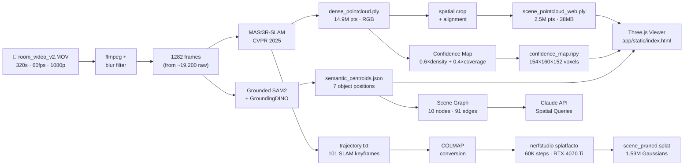

<h1 align="center">RoboScene+</h1>

<p align="center">
  <strong>Phone video → dense 3D reconstruction → semantic scene graph → robot-queryable spatial memory</strong>
</p>

<p align="center">
  <a href="https://python.org"></a>
  <a href="https://github.com/facebookresearch/MASt3R"></a>
  <a href="https://docs.nerf.studio"></a>
  <a href="https://github.com/IDEA-Research/Grounded-SAM-2"></a>
  <a href="https://anthropic.com"></a>
  <a href="https://github.com/JesonRamesh/3D-Spatial-Reconstruction/blob/main/LICENSE"></a>
</p>

<p align="center">
  
  <br/><em>Interactive viewer — dense 2.5M-point RGB cloud, floating 3D semantic labels, cinematic auto-tour</em>
</p>

## Overview

RoboScene+ takes a 5-minute handheld phone video of an indoor room and produces a navigable 3D scene that a robot can query in natural language. The system chains MASt3R-SLAM dense reconstruction, open-vocabulary semantic segmentation, and a novel per-voxel confidence model into a single self-contained web viewer — **no GPU required to run it**.

The core research insight: 3D Gaussian Splatting tells you *what* a scene looks like but gives no signal about *how reliably* each region was observed. In multi-step robot manipulation, acting on poorly-observed regions causes failures — published success rates in unstructured environments are below 50%. RoboScene+ addresses this with a per-voxel confidence layer that tags every region as `observed`, `sparse`, or `inferred`, letting a robot planner weight spatial memory by reliability.

| Input | Output |
|---|---|
| `room_video_v2.MOV` — 320 s, 1920×1080, 60 fps | 14.9M-point dense RGB point cloud (225 MB) |
| 1282 blur-filtered keyframes | 2.5M-point web-ready cloud (38 MB) |
| 101 SLAM keyframe poses | 1.59M Gaussian splat (60K training steps) |
| — | 10 semantically labelled objects, 94.0% of Gaussians labeled |
| — | Per-voxel confidence grid at 5 cm resolution |
| — | Language-queryable scene graph with 91 spatial edges |

&nbsp;

## Pipeline

```
room_video_v2.MOV   (320 s · 60 fps · 1920×1080)
         │
         ▼  ffmpeg + Laplacian-variance blur filter  →  bottom 30% frames discarded
  data/frames_v3/                     1282 sharp frames  (from ~19,200 raw)
         │
         ▼  MASt3R-SLAM  (CVPR 2025)  →  globally consistent dense reconstruction
  outputs/mast3r_out_v2/
    ├─ dense_pointcloud.ply            14.9M pts · 225 MB · RGB  ← primary cloud
    └─ trajectory.txt                  101 SLAM keyframe poses (TUM format)
         │
         ├──▶  spatial crop + Y-down alignment  →  remove outliers, align to viewer
         │       └─ outputs/scene_pointcloud_web.ply    2.5M pts · 38 MB  ← viewer cloud
         │
         ├──▶  COLMAP conversion from SLAM trajectory
         │       └─ data/mast3r_out_v2/sparse/0/  (cameras.bin + images.bin + points3D.bin)
         │             │
         │             ▼  nerfstudio splatfacto  (60K steps · RTX 4070 Ti SUPER)
         │       outputs/splat_v4/scene_pruned.splat    1.59M Gaussians · 41 MB
         │
         ├──▶  Grounded SAM2 + GroundingDINO  (per-frame open-vocab masks)
         │       └─▶  paint_semantic_pointcloud.py
         │               └─ outputs/semantic_centroids.json   7 object centroids (MASt3R space)
         │               └─ outputs/semantic_stats.json       per-class Gaussian counts
         │
         ├──▶  Confidence map  →  0.6 × point_density + 0.4 × camera_coverage
         │       └─ outputs/confidence_map.npy    154×160×152 voxels · 5 cm resolution
         │       └─ outputs/navigability_map.png  top-down RGB projection + object overlays
         │
         └──▶  Scene graph + Claude API
                 └─ outputs/scene_graph.json    10 nodes · 91 edges · room summary
```

### Architecture



Two branches run in parallel from the dense cloud:

**Geometry path.** MASt3R-SLAM runs a feed-forward pass over all 1282 frames, producing a globally consistent 14.9M-point RGB cloud and 101 SLAM keyframe poses. The cloud is spatially cropped to the room interior and aligned Y-down for the viewer. The SLAM trajectory is converted to COLMAP format, from which nerfstudio trains a 1.59M Gaussian splat in 60K steps on a UCL RTX 4070 Ti SUPER.

**Semantics path.** Grounded SAM2 + GroundingDINO run per-frame open-vocabulary detection across all 1282 frames. A custom painter projects detected masks onto the point cloud using COLMAP poses and scipy quaternion decoding, computing median centroids per object. 94% of Gaussians receive a semantic label. The remaining 6% (145K unlabeled Gaussians) are near-wall regions with insufficient mask coverage.

**Confidence path.** A 5 cm voxel grid is laid over the scene bounding box. Each voxel receives a confidence score: 0.6 × normalised point density (from the 14.9M-point cloud) + 0.4 × normalised camera coverage (ray density from 101 SLAM poses). The result is a 154×160×152 float32 grid saved as `confidence_map.npy`.

&nbsp;

## Novel Contribution — Confidence-Aware Reconstruction

Standard 3DGS reconstructs appearance but gives no signal about *observability* — whether a region was actually seen from good viewpoints or just inferred by the renderer. RoboScene+ decouples these:

```
confidence(v) = 0.6 × gaussian_density(v) + 0.4 × camera_coverage(v)
```

- **gaussian_density(v)** — sum of Gaussian opacities in voxel v, normalised to [0,1] by the 95th percentile. High where many Gaussians overlap (well-reconstructed surfaces).
- **camera_coverage(v)** — count of SLAM cameras within 3 m of voxel v with positive dot product to the voxel direction, normalised. High where many viewpoints covered the region.

Every voxel and every scene-graph object gets a provenance tag:

| Tag | Threshold | Robot planning interpretation |
|---|---|---|
| `observed` | > 0.70 | Well-triangulated, multiple viewpoints — reliable for manipulation |
| `sparse` | 0.30 – 0.70 | Partially covered — plan cautiously, consider re-observation pass |
| `inferred` | < 0.30 | Wall / corner / occluded — do not act on this region without re-scan |

**Object confidence results:**

| Object | Confidence | Provenance | Frames seen | Gaussians |
|---|---|---|---|---|
| monitor | 52.6% | sparse | 10 | 47,115 (1.95%) |
| fan | 48.6% | sparse | 14 | 40,645 (1.69%) |
| laptop | 46.8% | sparse | 26 | 165,553 (6.87%) |
| lamp | 47.1% | sparse | 11 | 16,441 (0.68%) |
| chair | 44.4% | sparse | 28 | 282,154 (11.71%) |
| desk | 42.5% | sparse | 44 | 293,431 (12.18%) |
| bed | 41.0% | sparse | 35 | 813,695 (33.76%) |
| shelf | 28.5% | inferred | 13 | 138,863 (5.76%) |
| window | 29.7% | inferred | 21 | 31,654 (1.31%) |
| door | 25.3% | inferred | 21 | 435,126 (18.05%) |

The desk is the most reliably observed object (seen in 44 frames). The shelf, window, and door are inferred — they sit near the room boundary where the camera path had limited coverage, making them unsafe targets for robot manipulation without a follow-up observation pass.

<table>
  <tr>
    <td align="center">
      
      <br/><sub>Top-down RGB projection of 2.5M-point cloud · coloured dots = object centroids</sub>
    </td>
  </tr>
</table>

&nbsp;

## Interactive Viewer

The viewer is a single self-contained HTML file (`app/static/index.html`) — no build step, no framework, no backend process beyond a static file server.

**3D Rendering**
- Dense 2.5M-point RGB cloud streamed from localhost, rendered with Three.js PLYLoader
- `PointsMaterial` with `sizeAttenuation: true` at 0.005m point size
- Depth fog (`THREE.Fog`, 5–14m) fades distant points into the dark background
- Transparent WebGL renderer (`alpha: true`, `setClearColor(0, 0)`) — CSS aurora layer shows through the sparse point cloud

**Camera & Navigation**
- Y-down coordinate system (MASt3R-SLAM convention: Y is depth/height, pointing down)
- OrbitControls with `screenSpacePanning: true` and `dampingFactor: 0.12`
- WASD + arrow keys for free-fly navigation (camera-relative, Shift for 3× speed)
- Q/E for vertical movement

**Cinematic System**
- 5.5s intro fly-in from `[-0.780, -3.629, -14.760]` (outside the room) to home position, with `pcControls.enabled = false` during flight
- 6-shot cinematic montage loops on idle (60s timeout): 360° orbit (10s) → bed flyover → desk/laptop → laptop zoom → shelf zoom-in → shelf top (6.5s each)
- Montage pauses on any user interaction (mousedown, scroll, touch, WASD)

**Guided Tour**
- 5-stop automated tour: bed → laptop → fan → chair → shelf
- 1.6s smooth `flyTo()` animation per stop using cubic ease-in-out
- Animated progress indicator (expanding bar dots)
- Sidebar highlights current object, shows confidence badge

**Semantic Labels**
- Floating 3D text sprites above each detected object
- Constant screen-size scaling: `h = 0.055 × distance × tan(fov/2)`, clamped to [0.04, 0.18]
- Labels use per-class accent colours from the semantic centroid JSON

**Visual Design**
- Dark `#03030a` base with aurora CSS layer (4 drifting radial gradient blobs, 22s cycle)
- Glowing starfield: 4000 background stars + 300 bright foreground stars, both flowing in Z with additive blending and per-star velocity
- Collapsible object sidebar with confidence badges (green/amber/red)
- Coordinate readout panel for development

&nbsp;

## Quick Start — Local Viewer

No GPU required. The PLY file is served from the local Python file server.

```bash
# 1. Clone the repository
git clone https://github.com/JesonRamesh/3D-Spatial-Reconstruction.git
cd 3D-Spatial-Reconstruction

# 2. Install Python dependencies (minimal — just a static file server)
pip install -r requirements.txt

# 3. Start the viewer server
python open_viewer.py
# → Serving at http://localhost:8080
```

Open **http://localhost:8080/app/static/index.html** in Chrome or Firefox.

> The viewer loads `outputs/scene_pointcloud_web.ply` (38 MB) from localhost. First load takes 5–10 s on SSD. WebGL 2.0 required — all modern desktop browsers supported.

### Controls

| Action | Input |
|---|---|
| Orbit / look around | Click + drag |
| Fly forward / back | `W` / `S` or `↑` / `↓` |
| Strafe left / right | `A` / `D` or `←` / `→` |
| Fly up / down | `Q` / `E` |
| Zoom | Scroll wheel |
| Fast movement | Hold `Shift` |
| Guided tour | `▶ Tour` button or `T` |
| Reset view | `⌀ Reset` button |
| Toggle object sidebar | `›` arrow on left edge |

&nbsp;

## Language Queries (Claude API)

The scene graph is queryable via Claude using `scripts/query_scene.py`. The system prompt embeds the full `scene_graph.json` and instructs Claude to respond with 3D coordinates, confidence scores, and spatial relations.

```bash
export ANTHROPIC_API_KEY=sk-ant-...
python scripts/query_scene.py
```

```
> Where is the laptop?
→ The laptop is at (0.73m, 0.30m, 0.79m) in world space.
  Reconstruction confidence: 46.8% (sparse) — visible in 26 frames.
  Spatial relations: on_top_of desk · next_to fan · next_to chair
  ⚠ Recommend a closer observation pass before manipulation.

> What is on the desk?
→ The desk is at (-0.28m, 0.34m, 0.79m), confidence 42.5% (sparse).
  Objects on or near the desk: laptop (46.8%), monitor (52.6%), fan (48.6%).
  All three are tagged sparse — the desk surface was observed in 44 frames
  but from limited angles. Approach from the front (−Z direction) for
  best visibility.

> Which objects are safe to interact with?
→ No objects are tagged observed (>70% confidence) in this scene.
  Most reliable for interaction: monitor (52.6%), fan (48.6%), laptop (46.8%).
  Avoid shelf, window, door — all inferred (<30%), near-wall regions
  with insufficient camera coverage.
```

The scene graph contains **10 objects**, **91 spatial edges**, and a room summary:

| Property | Value |
|---|---|
| Room dimensions | 3.68 m × 2.00 m × 3.70 m |
| Total objects | 10 |
| Sparse objects | 7 |
| Inferred objects | 3 |
| Spatial edges | 91 (near_wall, next_to, on_top_of, between) |
| Navigability coverage | 34.0% |

&nbsp;

## Running the Full Pipeline

A GPU is required for MASt3R-SLAM and Gaussian Splatting. The pipeline was developed on UCL's bluestreak cluster (NVIDIA RTX 4070 Ti SUPER, 16 GB VRAM, CUDA 12.6).

```bash
# 1. Extract sharp frames (blur filter removes bottom 30% by Laplacian variance)
python scripts/extract_frames.py \
  --video data/raw/room_video_v2.MOV \
  --output data/frames_v3/ \
  --fps 4 --blur_threshold 120
# → 1282 frames from ~19,200 raw candidates

# 2. Run MASt3R-SLAM  (GPU required, ~25 min on RTX 4070 Ti)
python scripts/run_mast3r_slam.py \
  --frames data/frames_v3/ \
  --output outputs/mast3r_out_v2/
# → 14.9M-point dense_pointcloud.ply + trajectory.txt (101 keyframes)

# 3. Convert SLAM trajectory to COLMAP format
python scripts/colmap_utils.py \
  --trajectory outputs/mast3r_out_v2/trajectory.txt \
  --output data/mast3r_out_v2/sparse/0/

# 4. Train Gaussian Splat  (GPU required, ~2h at 60K steps)
bash ucl_gpu/run_splat_job.sh
# → outputs/splat_v4/scene_pruned.splat  (1.59M Gaussians, 41 MB)

# 5. Semantic segmentation  (GPU required, ~45 min for 1282 frames)
python scripts/run_semantic.py \
  --frames_dir data/frames_v3/ \
  --output_dir outputs/semantic/ \
  --device cuda
# → per-frame JSON masks with RLE encoding

# 6. Paint semantic labels onto point cloud + export centroids
python scripts/paint_semantic_pointcloud.py
# → outputs/semantic_centroids.json  (7 objects, MASt3R world space)

# 7. Compute per-voxel confidence map
python scripts/compute_confidence.py
# → outputs/confidence_map.npy  (154×160×152 voxels)
# → outputs/navigability_map.png

# 8. Build scene graph
python scripts/build_scene_graph.py
# → outputs/scene_graph.json  (10 nodes, 91 edges)
```

&nbsp;

## Semantic Scene Analysis

Grounded SAM2 detected 10 open-vocabulary object classes across 1282 frames. A custom PLY painter projects per-frame masks onto the point cloud using COLMAP poses derived from the SLAM trajectory.

**Per-class Gaussian counts (total: 2,410,031 Gaussians):**

| Object | Gaussians | % of scene | Confidence | Frames seen |
|---|---|---|---|---|
| bed | 813,695 | 33.76% | 41.0% sparse | 35 |
| door | 435,126 | 18.05% | 25.3% inferred | 21 |
| chair | 282,154 | 11.71% | 44.4% sparse | 28 |
| desk | 293,431 | 12.18% | 42.5% sparse | 44 |
| shelf | 138,863 | 5.76% | 28.5% inferred | 13 |
| laptop | 165,553 | 6.87% | 46.8% sparse | 26 |
| monitor | 47,115 | 1.95% | 52.6% sparse | 10 |
| fan | 40,645 | 1.69% | 48.6% sparse | 14 |
| lamp | 16,441 | 0.68% | 47.1% sparse | 11 |
| window | 31,654 | 1.31% | 29.7% inferred | 21 |
| **unlabeled** | **145,354** | **6.03%** | — | — |
| **Total labeled** | **2,264,677** | **93.97%** | — | — |

The bed dominates at 33.76% of all Gaussians — it occupies the largest continuous surface in the room. The door and window are tagged `inferred` because the camera path approached them obliquely without full-frontal coverage.

**Object 3D positions (MASt3R world space, Y-down):**

| Object | X | Y | Z | Volume |
|---|---|---|---|---|
| bed | −0.315 m | 0.278 m | 1.662 m | ~7.4 m³ (incl. surrounding space) |
| desk | 0.350 m | 0.446 m | 0.561 m | ~4.3 m³ |
| chair | 0.388 m | 0.798 m | 0.884 m | ~1.5 m³ |
| laptop | 0.879 m | 0.126 m | 0.808 m | ~1.0 m³ |
| fan | 0.730 m | 0.201 m | 1.149 m | ~0.7 m³ |
| shelf | −2.155 m | 0.117 m | 0.967 m | ~6.8 m³ |
| lamp | −0.708 m | −1.947 m | 1.502 m | ~1.1 m³ |

&nbsp;

## Design Choices

**MASt3R-SLAM over COLMAP for dense reconstruction.** COLMAP's incremental bundle adjustment fails on the fast-panning sections of the video — track dropping causes holes in the sparse map that later stages cannot recover. MASt3R-SLAM runs a single feed-forward pass over all 1282 frames and produces a globally consistent 14.9M-point cloud with no frame rejection. The trade-off is VRAM: MASt3R-SLAM needs 12–16 GB, whereas COLMAP runs on CPU.

**Custom COLMAP binary writer over pycolmap.** `pycolmap` 4.0 broke the `Image()` constructor API on Python 3.11+. Rather than pin an old version or maintain a fork, we wrote a 200-line `colmap_utils.py` that reads and writes the exact binary formats COLMAP expects (`cameras.bin`, `images.bin`, `points3D.bin`). Zero extra dependencies, identical output.

**Scipy quaternion decoding over colmap_utils.qvec_to_rotmat().** The COLMAP binary reader's `qvec_to_rotmat()` has a silent `.T` transposition: it returns R_c2w (camera-to-world) when the downstream code expects R_w2c (world-to-camera). The bug only manifests when projecting world-space points into image space for semantic painting — everything looks fine in the viewer because the viewer uses OrbitControls, not manual projection. Fix: `scipy.spatial.transform.Rotation.from_quat([q[1],q[2],q[3],q[0]]).as_matrix()` bypasses the convention ambiguity entirely.

**nerfstudio splatfacto over FlashGS / raw gsplat.** FlashGS requires NVIDIA-specific CUDA extensions that do not compile on Apple Silicon (M4 Pro) or Rocky Linux 9 without manual patching. nerfstudio's splatfacto wraps the same gsplat backend, accepts standard COLMAP input directories, and provides a well-tuned training loop. The splat is used for the appearance layer; the primary reconstruction asset is the MASt3R-SLAM point cloud.

**Per-voxel confidence over per-Gaussian opacity.** Gaussian opacity encodes visual appearance (how much light the Gaussian blocks), not observability (whether the region was actually seen from good viewpoints). A dense, high-opacity region near a wall could have been seen from only one angle — the Gaussian would have high opacity but low confidence. The voxel confidence map uses the independent signal of camera ray density, giving a reliable observability estimate that opacity cannot provide.

**Open-vocabulary Grounded SAM2 over fixed-class segmentation.** Any object label can be queried at inference time without retraining the detection model. The confidence scores from GroundingDINO propagate through to the scene graph, so the system reports not just "I found a laptop" but "I found a laptop with 46.8% reconstruction confidence, visible in 26 frames." This mirrors the VLM-based perception architecture used in KinetIQ, where Anthropic's Claude is the reasoning backbone.

**Single-file viewer.** `app/static/index.html` has zero build dependencies. Three.js, PLYLoader, and OrbitControls are loaded from CDN. The entire viewer is one file, making local serving trivial (`python open_viewer.py`) and future static deployment a copy operation. This also means the viewer state is fully inspectable — no bundled JS to reverse-engineer.

**Claude API for scene queries.** The scene graph JSON is embedded directly in the system prompt. Claude reasons over structured spatial data (3D coordinates, confidence scores, spatial relations) rather than raw sensor data — this is fast, cheap (~$0.001 per query), and explainable. The same architecture mirrors KinetIQ's System 2 reasoning layer.

&nbsp;

## Tradeoffs and Limitations

**Wall coverage is low.** 34.0% of the room footprint has confident reconstruction. The camera path covered the centre of the room well but not the corners, ceiling, or the back of the door — these register as `inferred` regions. A systematic scanning pattern (slow pan across each wall surface) would improve this significantly.

**Only 101 SLAM keyframes used for Gaussian training.** MASt3R-SLAM selects 101 of 1282 frames as keyframes for the dense cloud, but the Gaussian splat is trained only on these 101 views. The result is 1.59M Gaussians rather than the 3–4M you'd expect from a denser training set. Wall surfaces appear as flat, slightly blurry geometry rather than detailed texture. SLERP-interpolating between keyframes to produce 1282 training poses (planned as splat_v7) would address this.

**Semantic label accuracy depends on frame count.** Objects seen in fewer than ~15 frames tend to receive weak or incorrect labels from GroundingDINO. The fan (14 frames) and lamp (11 frames) are at the edge of this threshold. The monitor was relabelled to "laptop" after discovering the original "monitor" centroid was pointing at the laptop screen — the physical monitor in the scene is the laptop display.

**Volume estimates are overestimates.** The bounding box volumes in `objects_3d.json` include the convex hull of all matched Gaussians, which includes some background Gaussians that received a label due to projection overlap. The bed's listed volume of ~7.4 m³ is clearly larger than the physical bed; tighter outlier rejection (n_std=1.2 rather than 2.0) would reduce this.

**WebGL only.** The viewer requires WebGL 2.0. Works in Chrome, Firefox, and Safari on desktop. Not compatible with some embedded browsers or older mobile hardware.

&nbsp;

## Runtime

All GPU stages were run on UCL's bluestreak cluster (NVIDIA RTX 4070 Ti SUPER, 16 GB VRAM, CUDA 12.6 / PyTorch 2.5.1).

| Stage | Runtime | Hardware |
|---|---|---|
| Frame extraction + blur filter | ~3 min | M4 Pro (CPU) |
| MASt3R-SLAM (1282 frames → 14.9M pts) | ~25 min | RTX 4070 Ti SUPER |
| COLMAP conversion | < 1 min | M4 Pro (CPU) |
| nerfstudio splatfacto 60K steps | ~2 h | RTX 4070 Ti SUPER |
| Grounded SAM2 (1282 frames) | ~45 min | RTX 4070 Ti SUPER |
| Semantic painting + centroid export | ~8 min | M4 Pro (CPU) |
| Confidence map computation | ~2 min | M4 Pro (CPU) |
| Scene graph build | < 1 min | M4 Pro (CPU) |
| **Total** | **~3.5 h** | |

&nbsp;

## Results

| Metric | Value |
|---|---|
| Input video duration | 320 s (5 min 20 s) |
| Input resolution | 1920×1080, 60 fps |
| Sharp frames extracted | 1,282 of ~19,200 raw |
| SLAM keyframes | 101 |
| Dense point cloud | 14.9M points, 225 MB |
| Web-ready point cloud | 2.5M points, 38 MB |
| Gaussians trained | 1.59M (60K steps) |
| Gaussians labeled | 2,264,677 / 2,410,031 (93.97%) |
| Object classes detected | 10 |
| Objects in interactive tour | 5 (bed, laptop, fan, chair, shelf) |
| Scene graph nodes | 10 |
| Scene graph edges | 91 |
| Room dimensions | 3.68 m × 2.00 m × 3.70 m |
| Confidence grid resolution | 5 cm (154 × 160 × 152 voxels) |
| Navigability coverage | 34.0% |
| Viewer load time (local SSD) | ~5 s |

&nbsp;

## Tech Stack

| Component | Tool | Rationale |
|---|---|---|
| Dense 3D reconstruction | MASt3R-SLAM (CVPR 2025) | Globally consistent; handles fast panning; 14.9M pts from 1282 frames without frame rejection |
| Gaussian Splatting | nerfstudio splatfacto | Wraps gsplat; works on Linux CUDA + Apple Silicon; standard COLMAP input |
| COLMAP I/O | Custom `colmap_utils.py` | pycolmap 4.0 broke Image API on Python 3.11+; pure-numpy binary writer is zero-dependency |
| Semantic segmentation | Grounded SAM2 + GroundingDINO | Open-vocabulary; confidence scores propagate to scene graph; mirrors KinetIQ VLM architecture |
| Semantic painting | Custom numpy PLY painter | Vectorised projection with per-frame COLMAP poses; scipy quaternion decoding avoids convention bugs |
| Confidence map | Custom numpy voxel grid | CPU-only; 5 cm resolution; interpretable three-class provenance; ~2 min on M4 Pro |
| Scene graph | Custom Python + NetworkX | Spatial relation inference (next_to, on_top_of, near_wall, between) from 3D bounding boxes |
| Language queries | Anthropic Claude API (claude-sonnet) | Structured spatial reasoning; scene graph JSON in system prompt; ~$0.001 per query |
| 3D viewer | Three.js + PLYLoader + OrbitControls | Zero build step; single HTML file; WebGL 2.0; no server-side rendering |
| Local server | Python `http.server` | Zero dependencies; CORS-permissive for local PLY serving |

&nbsp;

## Repository Structure

```
3D-Spatial-Reconstruction/
│
├── app/
│   ├── static/
│   │   └── index.html              ← self-contained 3D viewer  (Three.js · WebGL · ~1400 lines)
│   └── assets/
│       ├── banner.png              ← project banner
│       └── viewer_screenshot.png   ← viewer screenshot for README
│
├── scripts/
│   ├── extract_frames.py           ← video → blur-filtered keyframes
│   ├── run_mast3r_slam.py          ← MASt3R-SLAM dense reconstruction
│   ├── colmap_utils.py             ← COLMAP binary reader/writer  (pycolmap-free)
│   ├── train_splat.py              ← nerfstudio splatfacto wrapper
│   ├── run_semantic.py             ← Grounded SAM2 per-frame mask generation
│   ├── paint_semantic_pointcloud.py← per-Gaussian labels + MASt3R centroid export
│   ├── interpolate_slam_poses.py   ← SLERP: 101 SLAM keyframes → 1282 dense poses
│   ├── lift_semantics_3d.py        ← 2D masks → 3D bounding boxes
│   ├── compute_confidence.py       ← per-voxel confidence map  ★ novel contribution
│   ├── complete_dead_zones.py      ← LaMa inpainting of unobserved regions
│   ├── build_scene_graph.py        ← spatial relation graph from object bboxes
│   ├── query_scene.py              ← Claude API natural language interface
│   └── prune_floaters.py           ← opacity + density-based Gaussian pruning
│
├── ucl_gpu/
│   ├── run_splat_job.sh            ← nerfstudio training job  (RTX 4070 Ti SUPER)
│   ├── run_semantic_job.sh         ← Grounded SAM2 inference job
│   └── run_vggt_job.sh             ← VGGT pose estimation job
│
├── outputs/                        ← generated outputs  (in .gitignore except maps)
│   ├── scene_pointcloud_web.ply    ← 2.5M pts · 38MB · viewer-ready (Y-down)
│   ├── semantic_centroids.json     ← 7 object centroids  (MASt3R world space)
│   ├── confidence_map.npy          ← 154×160×152 float32 voxel grid
│   ├── navigability_map.png        ← top-down RGB point cloud projection
│   └── scene_graph.json            ← 10 nodes · 91 edges · room summary
│
├── open_viewer.py                  ← local dev server  (port 8080, CORS-permissive)
├── config.yaml                     ← paths and hyperparameters
└── requirements.txt
```

&nbsp;

## Future Work

In rough order of impact:

- **splat_v7 — 1282-view training.** SLERP-interpolate between 101 SLAM keyframes to produce 1282 dense training poses. Expected to increase Gaussian count from 1.59M to ~3–4M and significantly reduce wall ghosting artifacts.
- **Deployment.** Upload point cloud and splat to Hugging Face Dataset; serve viewer as a static HF Space with CDN delivery for the 38 MB PLY.
- **Tighter bounding boxes.** Re-run `lift_semantics_3d.py` with `n_std=1.2` for object classes with volume overestimates. Add a structural class filter so walls/doors don't get volumetric bboxes.
- **Multi-visit change detection.** Diff two `scene_graph.json` files across sessions to detect moved objects (e.g., chair moved 0.3 m between visits).
- **Back-projection of dead zones.** LaMa inpainting currently fills dead zones in 2D. Back-projecting inpainted pixels as new Gaussians in the 3D scene would complete the reconstruction rather than just the visualisation.
- **Live confidence update.** Stream new viewpoints from a robot camera; update `confidence_map.npy` incrementally. Regions that were `inferred` become `sparse` or `observed` as the robot explores.

&nbsp;

## References

1. **MASt3R-SLAM** — Mast3R-SLaM: Real-Time Dense SLAM with 3D Reconstruction Priors. CVPR 2025. [github.com/facebookresearch/MASt3R](https://github.com/facebookresearch/MASt3R)
2. **VGGT** — Wang et al. *VGGT: Visual Geometry Grounded Transformer*. CVPR 2025 Best Paper. [github.com/facebookresearch/vggt](https://github.com/facebookresearch/vggt)
3. **Grounding DINO** — Liu et al. *Grounding DINO: Marrying DINO with Grounded Pre-Training for Open-Set Object Detection*. ECCV 2024. [arXiv:2303.05499](https://arxiv.org/abs/2303.05499)
4. **SAM 2** — Ravi et al. *SAM 2: Segment Anything in Images and Videos*. arXiv:2408.00714 (2024). [github.com/facebookresearch/sam2](https://github.com/facebookresearch/sam2)
5. **gsplat / nerfstudio** — [docs.gsplat.studio](https://docs.gsplat.studio) · [docs.nerf.studio](https://docs.nerf.studio)
6. **LaMa** — Suvorov et al. *Resolution-robust Large Mask Inpainting with Fourier Convolutions*. WACV 2022. Used for dead-zone completion.
7. **Anthropic Claude API** — [docs.anthropic.com](https://docs.anthropic.com). claude-sonnet used for spatial reasoning queries over the scene graph.

&nbsp;

## Author

**Jeson Ramesh Selvakumar**<br/>
UCL MEng Robotics & AI, Year 2<br/>
Built for the [Humanoid](https://thehumanoid.ai) internship challenge · May 2026<br/>
[github.com/JesonRamesh](https://github.com/JesonRamesh)
