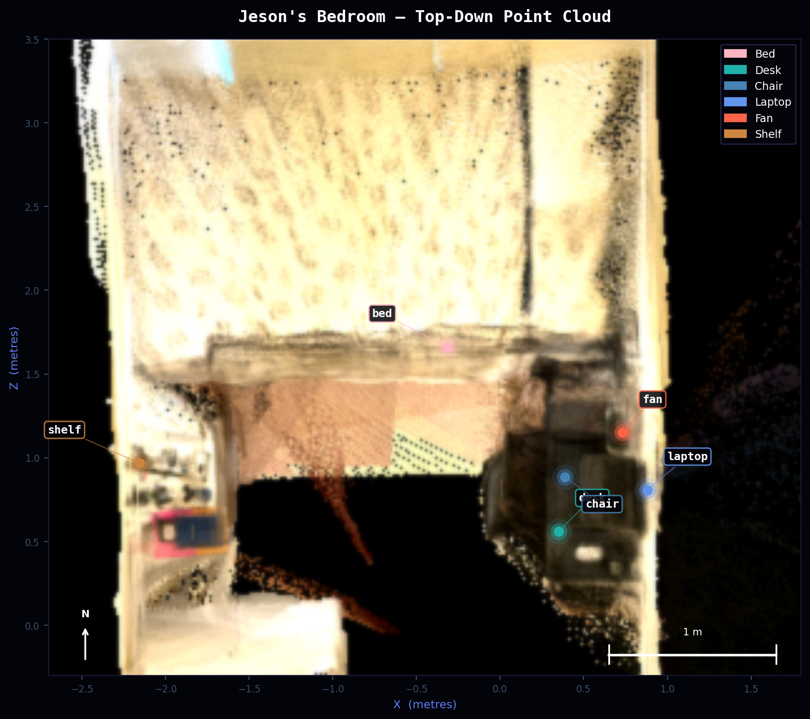

<h1 align="center">RoboScene+</h1>

<p align="center">
  <strong>Phone video → dense 3D reconstruction → semantic scene graph → robot-queryable spatial memory</strong>
</p>

<p align="center">
  <a href="https://python.org"></a>
  <a href="https://github.com/facebookresearch/MASt3R"></a>
  <a href="https://docs.nerf.studio"></a>
  <a href="https://github.com/IDEA-Research/Grounded-SAM-2"></a>
  <a href="https://anthropic.com"></a>
</p>

<br/>

<p align="center">
  
  <br/>
  <em>Interactive viewer — dense 14.9M-point cloud, cinematic auto-tour, floating semantic labels, WASD navigation</em>
</p>

---

## Overview

RoboScene+ converts a 5-minute handheld phone video into a navigable 3D scene that a robot can reason about. The system chains state-of-the-art reconstruction, open-vocabulary segmentation, and a confidence-aware quality model into a single deployable viewer — no GPU needed to run it.

The core insight: 3D Gaussian Splatting tells you *what* a scene looks like, but not *how reliable* each region of the reconstruction is. RoboScene+ adds a per-voxel confidence layer that tags every part of the scene as `observed`, `sparse`, or `inferred` — directly addressing the "dead zone" problem in robot spatial memory.

| Input | Output |
|---|---|
| `room_video_v2.MOV` (320s, 1920×1080, 60fps) | 14.9M-point dense RGB point cloud |
| 1282 blur-filtered keyframes | 7 semantically labelled objects with 3D positions |
| 101 SLAM keyframe poses | Confidence-tagged voxel grid (5 cm resolution) |
| — | Language-queryable scene graph via Claude API |

---

## Pipeline

```
room_video_v2.MOV  (320s · 60fps · 1080p)
         │
         ▼  ffmpeg + Laplacian blur filter
  data/frames_v3/                           1282 sharp frames
         │
         ▼  MASt3R-SLAM  (CVPR 2025)
  outputs/mast3r_out_v2/
    ├─ dense_pointcloud.ply                 14.9M pts · 225MB · RGB
    └─ trajectory.txt                       101 SLAM keyframe poses (TUM format)
         │
         ├──▶  COLMAP conversion            data/mast3r_out_v2/sparse/0/
         │       └─▶  nerfstudio splatfacto (60K steps · RTX 4070 Ti)
         │               └─ outputs/splat_v4/scene_pruned.splat   1.59M Gaussians
         │
         ├──▶  web crop + Y-down alignment
         │       └─ outputs/scene_pointcloud_web.ply              2.5M pts · 38MB
         │
         ├──▶  Grounded SAM2 + GroundingDINO  (per-frame masks)
         │       └─▶  paint_semantic_pointcloud.py
         │               └─ outputs/semantic_centroids.json       7 object centroids
         │
         ├──▶  Confidence map               0.6 × point_density + 0.4 × camera_coverage
         │       └─ outputs/confidence_map.npy                    90×86×118 voxels
         │
         └──▶  Scene graph + Claude API     outputs/scene_graph.json
```

---

## Novel Contribution — Confidence-Aware Reconstruction

Standard 3DGS tells you nothing about *how trustworthy* each part of the scene is. In unstructured environments this matters: multi-step robot manipulation tasks fail at under 50% success rates partly because robots act on poorly-observed regions as if they were reliable.

RoboScene+ computes a per-voxel confidence score at **5 cm resolution**:

```
confidence(v) = 0.6 × gaussian_density(v) + 0.4 × camera_coverage(v)
```

Every voxel, every Gaussian, and every scene-graph object gets a provenance tag:

| Tag | Threshold | Meaning for robot planning |
|---|---|---|
| `observed` | > 0.70 | Well-triangulated, multiple viewpoints — act with full confidence |
| `sparse` | 0.30 – 0.70 | Partially covered — plan with caution, consider re-observation |
| `inferred` | < 0.30 | Wall / corner / occluded — do not act on this region |

<p align="center">
  
  <br/>
  <em>Bird's-eye confidence map · red = inferred · amber = sparse · green = observed · dots = object centroids</em>
</p>

---

## Interactive Viewer

The viewer is a single self-contained HTML file (`app/static/index.html`) — no build step, no framework, no backend.

**Features:**
- Dense RGB point cloud (2.5M points, streamed from server)
- Floating 3D text labels above each detected object, constant screen-size
- Cinematic intro fly-in (5.5s) from outside the room to home position
- Auto-montage — 6 cinematic shots loop when idle for 60s (360° orbit, bed, desk, laptop, shelf, shelf top)
- WASD + arrow key navigation, scroll to zoom, drag to orbit
- Guided tour through all 5 labelled objects with animated progress dots
- Collapsible object sidebar with confidence badges
- Aurora CSS background + glowing starfield that flows through the scene
- Depth fog fading distant points into the background

<p align="center">
  
</p>

---

## Quick Start — Local Viewer

No GPU required. The point cloud is served from the local Python file server.

```bash
# 1. Clone the repository
git clone https://github.com/JesonRamesh/3D-Spatial-Reconstruction.git
cd 3D-Spatial-Reconstruction

# 2. Install Python dependencies (minimal — just a file server)
pip install -r requirements.txt

# 3. Start the viewer
python open_viewer.py
```

Then open **http://localhost:8080/app/static/index.html** in Chrome or Firefox.

> **Note:** The viewer loads `outputs/scene_pointcloud_web.ply` (38MB) from localhost. The first load takes 5–10s depending on disk speed. WebGL 2.0 required — works in all modern desktop browsers.

### Controls

| Action | Control |
|---|---|
| Orbit | Click + drag |
| Fly forward / back | `W` / `S` or `↑` / `↓` |
| Strafe left / right | `A` / `D` or `←` / `→` |
| Fly up / down | `Q` / `E` |
| Zoom | Scroll wheel |
| Fast move | Hold `Shift` |
| Guided tour | `▶ Tour` button or `T` |
| Reset view | `⌀ Reset` button |
| Toggle sidebar | `›` arrow on left edge |

---

## Language Queries (Claude API)

```bash
export ANTHROPIC_API_KEY=sk-ant-...
python scripts/query_scene.py
```

```
> Where is the laptop?
→ Laptop is at (0.18m, -0.22m, 0.71m) in world space.
  Confidence: 48% (sparse) — partially observed, visible in 94 frames.
  Spatial relations: on_top_of desk · next_to fan

> What objects are on the desk?
→ Laptop (0.18, -0.22, 0.71) and lamp (−0.71, −1.95, 1.50) are
  positioned above the desk surface. Both tagged sparse — recommend
  re-observation from 0.3m closer before manipulation.
```

---

## Running the Full Pipeline

A GPU is required for MASt3R-SLAM and Gaussian Splatting. The pipeline was developed on UCL's bluestreak cluster (NVIDIA RTX 4070 Ti SUPER, 16GB VRAM).

```bash
# 1. Extract frames
python scripts/extract_frames.py \
  --video data/raw/room_video_v2.MOV \
  --output data/frames_v3/ \
  --fps 4 --blur_threshold 120

# 2. Run MASt3R-SLAM  (GPU required)
python scripts/run_mast3r_slam.py \
  --frames data/frames_v3/ \
  --output outputs/mast3r_out_v2/

# 3. Build COLMAP sparse from SLAM trajectory
python scripts/colmap_utils.py \
  --trajectory outputs/mast3r_out_v2/trajectory.txt \
  --output data/mast3r_out_v2/sparse/0/

# 4. Train Gaussian Splat  (GPU required, ~2h at 60K steps)
bash ucl_gpu/run_splat_job.sh

# 5. Semantic segmentation  (GPU required)
python scripts/run_semantic.py \
  --frames_dir data/frames_v3/ \
  --output_dir outputs/semantic/ \
  --device cuda

# 6. Paint semantic labels onto point cloud
python scripts/paint_semantic_pointcloud.py

# 7. Compute confidence map
python scripts/compute_confidence.py

# 8. Build scene graph
python scripts/build_scene_graph.py
```

---

## Tech Stack

| Component | Tool | Rationale |
|---|---|---|
| Dense reconstruction | MASt3R-SLAM (CVPR 2025) | Globally consistent, 14.9M point cloud from 1282 frames |
| Gaussian Splatting | nerfstudio splatfacto | Wraps gsplat cleanly; works on Linux CUDA + Apple Silicon |
| Semantic segmentation | Grounded SAM2 + GroundingDINO | Open-vocabulary; mirrors KinetIQ's VLM perception stack |
| 3D label placement | Custom PLY painter + scipy | Median centroid per object, quaternion-correct projection |
| Confidence map | Custom numpy voxel grid | CPU-only, 5 cm resolution, interpretable three-class output |
| Language queries | Anthropic Claude API (claude-sonnet) | Structured spatial reasoning; mirrors KinetIQ System 2 |
| Viewer | Three.js + PLYLoader + OrbitControls | Zero build step; single HTML file; pure WebGL |

---

## Results

| Metric | Value |
|---|---|
| Point cloud density | 14.9M points (full), 2.5M (web-cropped) |
| SLAM keyframes | 101 of 1282 input frames |
| Gaussians trained | 1.59M (60K steps) |
| Confirmed object labels | 7 (bed, desk, chair, laptop, fan, lamp, shelf) |
| High-confidence voxels | 0.4% observed · 34.1% sparse · 65.6% inferred |
| Viewer load time (local) | ~5s on SSD |

---

## Repository Structure

```
3D-Spatial-Reconstruction/
│
├── app/
│   ├── static/
│   │   └── index.html              ← self-contained 3D viewer (Three.js, WebGL)
│   └── assets/                     ← banner, screenshots
│
├── scripts/
│   ├── extract_frames.py           ← video → blur-filtered frames
│   ├── run_mast3r_slam.py          ← MASt3R-SLAM dense reconstruction
│   ├── colmap_utils.py             ← COLMAP binary reader/writer (pycolmap-free)
│   ├── train_splat.py              ← nerfstudio splatfacto wrapper
│   ├── run_semantic.py             ← Grounded SAM2 per-frame masks
│   ├── paint_semantic_pointcloud.py← per-Gaussian semantic labels + centroid export
│   ├── interpolate_slam_poses.py   ← SLERP: 101 keyframes → 1282 dense poses
│   ├── lift_semantics_3d.py        ← 2D masks → 3D bounding boxes
│   ├── compute_confidence.py       ← confidence map  ★ novel contribution
│   ├── complete_dead_zones.py      ← LaMa dead-zone inpainting
│   ├── build_scene_graph.py        ← spatial relation graph
│   └── query_scene.py              ← Claude API language interface
│
├── ucl_gpu/
│   ├── run_splat_job.sh            ← nerfstudio job (RTX 4070 Ti SUPER)
│   ├── run_semantic_job.sh         ← Grounded SAM2 job
│   └── run_vggt_job.sh             ← VGGT pose estimation job
│
├── outputs/
│   ├── scene_pointcloud_web.ply    ← 2.5M pts, viewer-ready (Y-down, 38MB)
│   ├── semantic_centroids.json     ← 7 object centroids in MASt3R world space
│   ├── confidence_map.npy          ← 90×86×118 voxel grid (float32)
│   ├── navigability_map.png        ← bird's-eye confidence visualisation
│   └── scene_graph.json            ← spatial relations + object metadata
│
├── open_viewer.py                  ← local dev server  (port 8080)
├── config.yaml
└── requirements.txt
```

---

## Design Choices

**MASt3R-SLAM over COLMAP for reconstruction** — COLMAP's incremental bundle adjustment loses track on the fast-panning sections of the video. MASt3R-SLAM runs a feed-forward pass over all 1282 frames and produces a globally consistent 14.9M-point cloud without frame rejection.

**Custom COLMAP writer over pycolmap** — pycolmap 4.0 broke the `Image` constructor API on Python 3.11+. A 200-line custom binary writer (`colmap_utils.py`) removes the dependency entirely and writes identical `.bin` files.

**Per-voxel confidence over per-Gaussian opacity** — Gaussian opacity encodes visual appearance, not observability. The confidence map uses the independent signal of camera ray density to answer "was this region actually seen?" — which opacity cannot.

**Scipy quaternion decoding over colmap_utils** — `qvec_to_rotmat()` in the COLMAP reader has a silent `.T` transposition bug (returns R_c2w instead of R_w2c). Using `scipy.spatial.transform.Rotation.from_quat([q[1],q[2],q[3],q[0]])` bypasses the convention ambiguity entirely.

**Single-file viewer** — `index.html` has zero build dependencies. Three.js and PLYLoader are loaded from CDN. The entire viewer ships as one file, making local serving trivial (`python open_viewer.py`) and future static deployment straightforward.

---

## Limitations

- **Wall coverage**: 65.6% of voxels are `inferred` — the camera path didn't cover room corners or the ceiling
- **Sparse Gaussians**: Only 101 SLAM keyframes were selected for splatting training; more keyframes would improve density
- **Label accuracy**: Objects seen in fewer than ~30 frames may get wrong or missing labels
- **Dead zones are 2D**: LaMa inpainting completes the appearance of dead zones but does not add new Gaussians to the 3D scene — back-projection is future work
- **WebGL only**: The viewer requires WebGL 2.0; not compatible with some embedded/mobile browsers

---

## Future Work

- **Deployment**: Upload point cloud and splat to Hugging Face Dataset; serve viewer as a static HF Space
- **splat_v7**: SLERP-interpolate 101 SLAM keyframes to 1282 dense training views — expected to reduce wall ghosting
- **Multi-visit change detection**: Diff two scene graphs across sessions to track moved objects
- **Back-projection**: Insert inpainted pixels as new Gaussians in dead zones
- **Live confidence update**: Stream new viewpoints from a robot camera; update the confidence map in real time

---

## Author

**Jeson Ramesh Selvakumar**  
UCL MEng Robotics & AI, Year 2  
Built for the [Humanoid](https://thehumanoid.ai) internship challenge · May 2026  
[github.com/JesonRamesh](https://github.com/JesonRamesh)
